# Architecture — MCP Servers, Type Contracts & Monorepo Structure

> The heavy lifting (Hardhat node, solc compilation, transaction tracing, AXL node, KeeperHub client, preview dev server, workspace filesystem, terminal PTY sessions) runs on a **Node.js backend**. The browser frontend renders the interactive surface but is not the source of truth for project state.

---

## System Overview

```mermaid
graph TD
    subgraph "Frontend (Browser - SvelteKit)"
        U[User Prompt] --> A[Crucible Agent - OpenClaw extension]
        A -->|writes code| E[Code Editor - CodeMirror]
    S[Workspace Shell] -->|renders| P[Live dApp Preview]
        P --> T[Transaction Inspector]
    A -->|logs + commands| TT[Terminal - xterm.js]
    W[Embedded Dev Wallet] -->|approval state| S
    end

    subgraph "0G Network"
        C0G[0G Compute - sealed inference]
        S0G[0G Storage - KV memory + Log history]
    end

    OAI[OpenAI-compatible Fallback - OpenRouter or similar]

    subgraph "Backend (Node.js Server)"
      IR[Inference Router]
      FS[Workspace Filesystem]
      V[Preview Dev Server Manager]
      PTY[PTY Session Manager]
        N[Hardhat Node - local EVM, fork, snapshots]
        M1[chain-mcp]
        M2[compiler-mcp]
        M3[deployer-mcp]
        M4[wallet-mcp]
        M5[memory-mcp - 0G Storage wrapper]
        M6[mesh-mcp - AXL peer queries]
      M7[terminal-mcp]
        K[KeeperHub MCP - ship to testnet/mainnet]
        X[AXL Node - P2P knowledge mesh]
    end

    A -->|inference| IR
    IR -->|primary| C0G
    IR -.->|fallback| OAI
    A <-->|MCP over HTTP| M1
    A <-->|MCP over HTTP| M2
    A <-->|MCP over HTTP| M3
    A <-->|MCP over HTTP| M4
    A <-->|MCP over HTTP| M5
    A <-->|MCP over HTTP| M6
    A <-->|MCP over HTTP| M7
    A <-->|MCP over HTTP| K
    M5 <--> S0G
    M6 <--> X
    X <-.->|peer Crucible nodes| X
    FS --- M2
    FS --- M3
    FS --- V
    FS --- PTY
    P -->|EIP-1193 bridge postMessage| S
    S -->|POST /workspace/:id/rpc via control plane| N
    V -->|workspace preview URL| P
    PTY -->|terminal WebSocket| TT
    N --- M1
    N --- M3
    K -->|simulate, execute, audit| EXT[Public Chains - Sepolia/Base/Mainnet]
```



---

## Dev Topology (Portless)

Portless is used for readable local development URLs and to avoid hardcoded ports in the browser-facing surfaces.

| Surface                    | Example URL                                        | Notes                                    |
| :------------------------- | :------------------------------------------------- | :--------------------------------------- |
| Main workspace app         | `https://crucible.localhost`                       | Frontend + API + WebSocket entrypoint    |
| Workspace preview          | `https://preview.{workspaceId}.crucible.localhost` | Per-workspace frontend dev server        |
| Browser WebSocket channels | `wss://crucible.localhost/ws/*`                    | Agent stream, RPC proxy, terminal stream |

Internal MCP services still run on loopback ports. Portless is for the human-facing and browser-facing surfaces, not for every internal service.

---

## Runtime Decisions

### Use Portless

Yes. It gives Crucible readable local URLs, reduces port-collision noise during development, and makes it easier for both humans and agents to reason about service locations.

### Terminal Rendering and PTY Backend

The frontend uses **xterm.js v6.0.0** with FitAddon for terminal UI and resize handling. The backend runs bash **inside the per-workspace Docker runtime container** via a raw HTTP/1.1 socket hijack to the Docker engine:

1. Backend connects to `/var/run/docker.sock` via `net.Socket`
2. Issues `POST /containers/{id}/exec` + `POST /exec/{id}/start` with `Upgrade: tcp`
3. Docker responds with `101 Switching Protocols`, converting the socket to a raw TTY stream
4. Terminal I/O flows directly through the upgraded socket — no `node-pty`, no daemon
5. `exec.inspect()` on socket close yields the exit code

This approach was chosen because:
- Bun's process model cannot sustain interactive bash (SIGHUP on spawn)
- dockerode's `hijack` mode hangs under Bun's Node compat layer
- Raw socket with HTTP/1.1 handshake is a few dozen lines and avoids both bugs

### Use an OpenAI-Compatible Fallback

Yes, but only as a **degraded-mode reliability path**.

- **Primary:** 0G Compute
- **Fallback:** OpenAI-compatible endpoint such as OpenRouter
- **Allowed triggers:** 0G rate limit, insufficient 0G balance, provider outage, or manual admin override
- **Not allowed:** silently using fallback during the judged 0G demo while claiming 0G handled the request

The active inference provider must be visible in the UI. If the provider is 0G, the agent surfaces a verifiable receipt. If fallback is active, the UI shows fallback mode instead of pretending a 0G receipt exists.

### Do Not Use WebContainers for the Core Runtime

No. WebContainers are excellent for browser-hosted Node.js development, but Crucible's core runtime depends on long-lived backend-managed processes:

- Hardhat node with deep tracing and persistent chain state
- AXL node binary as a separate process
- Per-workspace preview process supervision
- Shared PTY sessions between user and agent

WebContainers are a poor fit for those constraints. The browser should render the IDE surface; the backend should own the runtime.

---

## Runtime Topology — As Implemented

This section describes the real runtime on `main` today. The rest of this document describes the eventual shape; treat anything not listed here as planned.

```
                ┌────────────────────────────────── Host (laptop / EC2) ──────────────────────────────────┐
                │                                                                                          │
  Browser ─────►│  Control plane (packages/backend, Bun + Hono, port 3000)                                 │
                │  • better-auth: SIWE (primary) + Google (optional) ── Postgres (Prisma)                  │
                │  • @crucible/agent (AI SDK v6 + @ai-sdk/mcp) drives tool calls over MCP                  │
                │  • REST: /api/workspace, /api/workspaces, /api/runtime,                                  │
                │          /api/agent/stream (SSE, message_delta tokens), /api/inference                  │
                │  • runtime-docker.ts ─── /var/run/docker.sock                                            │
                │                            │                                                             │
                │                            ▼   one per workspace, dynamic host port mapping              │
                │  ┌─── crucible-ws-<id> (image: crucible-runtime:latest) ────────────────────┐            │
                │  │   bind / volume mount:  /workspace ◄── ${CRUCIBLE_WORKSPACES_ROOT}/<id>  │            │
                │  │   • mcp-chain    (in-container 3100, host port published dynamically)    │            │
                │  │   • mcp-compiler (in-container 3101, host port published dynamically)    │            │
                │  │   • mcp-deployer (in-container 3102, host port published dynamically)    │            │
                │  │   • mcp-wallet   (in-container 3103, host port published dynamically)    │            │
                │  │   • mcp-memory   (in-container 3104, host port published dynamically)    │            │
                │  │   • bash shell   (via docker exec hijack, TTY mode, shared user+agent)   │            │
                │  │   • [planned] mcp-terminal 3106 (MCP wrapper for agent tool access)    │            │
                │  └──────────────────────────────────────────────────────────────────────────┘            │
                │                                                                                          │
                │  Preview (per workspace, on host — NOT inside runner)                                    │
                │  • preview-manager.ts: spawns `vite dev` for <workspaceDir>/frontend/                   │
                │  • injects /__crucible/preview-bridge.js into preview origin before start               │
                │  • persists previewUrl to workspace_runtime; frontend iframes it                         │
                │                                                                                          │
                │  Postgres ── workspace, workspace_runtime, user, session, account, verification,         │
                │              walletAddress (SIWE-bound EOAs)                                             │
                │  Disk     ── ${CRUCIBLE_WORKSPACES_ROOT}/<id>/{contracts,frontend,.crucible/...}         │
                └──────────────────────────────────────────────────────────────────────────────────────────┘
```

Boundaries that hold today:

- **Browser ↔ control plane only.** No browser code knows about the runner container's host port.
- **Control plane ↔ runner = HTTP over `127.0.0.1:<published>`.** Discovered from `docker inspect`, persisted in `workspace_runtime.{chainPort,compilerPort,deployerPort,walletPort,memoryPort,...}`, recovered automatically after a runner restart.
- **One runner per workspace.** Hard isolation between workspaces; `tool_exec` on workspace A cannot reach workspace B.
- **Workspace files on host disk.** Mounted into the runner. The runner is disposable; the volume is not.
- **Auth in the control plane only.** The runner has no auth concept — it trusts loopback callers from the control plane. This is why the runner's host ports must stay bound to `127.0.0.1` (or a private overlay network) and never be exposed publicly.
- **Workspaces are user-owned.** `Workspace.userId` is `NOT NULL` with `onDelete: Cascade`. `GET /api/workspace/:id` returns `404` (not `403`) for foreign IDs to avoid leaking existence. Centralized `requireSession` middleware in `lib/auth.ts` sets `c.get('userId')`.

What is **not** here yet, and where it will land when added:

- `mcp-terminal` (agent-callable MCP wrapper) — the WebSocket `/ws/terminal` PTY backend is shipped and working via `docker exec` hijack, and the xterm.js frontend bridge is wired in `terminal-pane.svelte`. The MCP server wrapper (port 3106) that allows the agent to call terminal tools (`exec`, `write`, `resize`) is still planned. Once added, it wraps the same in-container bash surface.
- `mcp-mesh` — control-plane / sidecar (cross-workspace, deployment-scoped).
- `mcp-memory` durable backend — server is in-runner today but storage is local; a 0G Storage KV+Log adapter still needs to land.
- KeeperHub `ship` — control-plane HTTP client, never inside a runner.
- Preview subdomain gateway — the dev server is already running on the host (see above); what's missing is the Caddy gateway that maps `preview.<id>.crucible.localhost` to the per-workspace port. Until that lands, `sendToShell` in the bridge IIFE uses `'*'` as the target origin (acceptable for localhost dev; a Phase 5 TODO marks the exact line in `preview-manager.ts`).

---

## Preview Isolation and Wallet Bridge

The preview pane renders the workspace's Vite dev server in an `<iframe>`. For the dApp preview to be interactive (send transactions, call contracts), `window.ethereum` inside the iframe must point at the local Hardhat node. Because the iframe may run on a different origin from the shell (and will on a subdomain once the portless gateway lands), the connection goes through a three-layer postMessage bridge.

### Layer 1 — Bridge Script (preview origin)

`preview-manager.ts → buildBridgeScript()` generates a plain JavaScript IIFE (no bundler, no imports) that is written to `<workspaceDir>/frontend/public/__crucible/preview-bridge.js` and injected as the first `<script>` in `index.html` before each Vite dev server starts. The script:

- Replaces `window.ethereum` with an EIP-1193 provider that forwards `request()` calls over `postMessage` to the parent shell.
- Validates every incoming message against `protocol: 'crucible-preview-bridge'` + `version: 1` before acting.
- Announces itself via **EIP-6963** (`eip6963:announceProvider`) so wagmi/viem discover "Crucible" instead of falling back to MetaMask.
- Sends a `hello` frame on `DOMContentLoaded` to kick off the handshake.
- Enforces `ALLOWED_RPC_METHODS` client-side — disallowed methods are rejected immediately without a round-trip.

### Layer 2 — Shell Handler (parent window)

`packages/frontend/src/lib/eip1193-bridge.ts → createEip1193Bridge()`:

- Listens for `message` events; drops any that did not originate from `iframeEl.contentWindow`.
- Parses every frame with `PreviewBridgeMessageSchema` (Zod discriminated union) — malformed frames are silently dropped.
- Responds to `hello` with `hello_ack` carrying the current `chainId` (default `0x7a69` before first chain sync) so the preview can emit `chainChanged` immediately without a round-trip.
- Forwards `rpc_request` frames to `POST /api/workspace/:id/rpc` with `credentials: 'include'`.
- Posts `rpc_response` back to the iframe using **the exact `e.origin`** from the original message — never `'*'`.

### Layer 3 — Backend RPC Endpoint

`packages/backend/src/api/rpc.ts → POST /workspace/:id/rpc`:

- Requires a valid session (enforced by `requireSession` middleware).
- Verifies workspace ownership (foreign workspaces return 404 to avoid ID leakage).
- Validates `method` against `AllowedRpcMethodSchema` — disallowed methods return 400 before hitting the chain.
- **Fast-paths** `eth_chainId`, `eth_accounts`, and `eth_requestAccounts` from DB `chainState` without a container round-trip; auto-starts the node on first `eth_requestAccounts` if `chainState` is null.
- Proxies all other methods to `http://127.0.0.1:{chainPort}/json-rpc` inside the workspace runner (mcp-chain), which validates and forwards to Hardhat.

### Protocol Reference

All frames use the `crucible-preview-bridge` v1 envelope defined in `packages/types/src/preview.ts`. Message types:

| Direction       | Type           | Purpose                                      |
| :-------------- | :------------- | :------------------------------------------- |
| preview → shell | `hello`        | Announce; kicks off handshake                |
| shell → preview | `hello_ack`    | Reply with negotiated `chainId`              |
| preview → shell | `rpc_request`  | EIP-1193 `request()` call                    |
| shell → preview | `rpc_response` | Result or error from the chain               |
| preview → shell | `subscribe`    | Request EIP-1193 event forwarding (Phase 1+) |
| shell → preview | `event`        | Push `accountsChanged`, `chainChanged`, etc. |

### Security Properties

- Origin check: reply `targetOrigin` is always the exact `e.origin` from the incoming frame.
- Source check: `e.source !== iframeEl.contentWindow` drops messages from any other window.
- Allowlist enforced independently at three points: bridge IIFE, shell handler (schema), and backend route.
- No `hardhat_*` or `debug_*` methods are in `ALLOWED_RPC_METHODS`.
- Auth gate on the backend ensures another browser tab cannot call `/workspace/:id/rpc` without a valid session and ownership.

### Phase 5 Note

Once the portless Caddy gateway is live (`preview.<id>.crucible.localhost`), the IIFE's `sendToShell` call must be updated from `postMessage(msg, '*')` to `postMessage(msg, SHELL_ORIGIN)` where `SHELL_ORIGIN` is the known shell origin. The exact line is marked with a `// Phase 5 TODO` comment in `preview-manager.ts`.

---

## Hosting and Storage Model

Crucible is a **stateful web application**. Yes, we need real servers for the runtime.

There are two valid deployment shapes:

- **Trusted demo / internal testing:** one stateful backend instance directly owns per-workspace child processes.
- **Public live deployment:** the same logical runtime is packaged as a **control plane + isolated workspace runners**.

The second shape is the one we should use for live public testing. See [DEPLOYMENT.md](./DEPLOYMENT.md).

### What We Actually Host

For the hackathon MVP, the simplest correct stateful runtime is:

- **One Bun/Hono application server per demo instance**
  This serves the frontend shell, API routes, and WebSocket endpoints.
- **One persistent local disk or mounted volume**
  This stores workspace files, artifacts, logs, and workspace metadata.
- **One AXL node process per Crucible backend instance**
  The node belongs to the backend instance, not to each workspace.
- **One workspace runtime per workspace**
  In trusted mode this is a set of child processes inside the backend host. In public deployment this becomes a dedicated workspace runner container. Each workspace runtime owns the local Hardhat chain, PTY shell, and preview server for that workspace.

For the demo, that backend can run directly on a laptop or on a single stateful VM. For a hosted product, the same runtime can move to a long-lived machine on EC2 or a similar stateful host. The important point is that it **cannot be purely serverless**.

### Where the Data Actually Lives

| Data                                                 | Where it lives                                                | Why                                                      |
| :--------------------------------------------------- | :------------------------------------------------------------ | :------------------------------------------------------- |
| Editor files, generated code, artifacts              | Backend disk/volume under `/workspace/{workspaceId}/`         | Fast local reads/writes for compile, preview, and deploy |
| Hardhat chain state, snapshots, nonces               | In the per-workspace Hardhat process + `.crucible/state.json` | Must be low-latency and isolated                         |
| Terminal session state                               | Backend PTY process memory + `.crucible/logs/`                | Shared live shell between user and agent                 |
| Agent memory patterns, debugging history, provenance | 0G Storage KV + Log                                           | Persistent cross-session, cross-node memory              |
| Execution audit trails for public-chain txs          | KeeperHub                                                     | External execution/provenance system                     |
| UI state (pane layout, selections, current file)     | Browser memory / local storage                                | Pure presentation state                                  |

### What 0G Storage Is Not Used For

0G Storage is **not** the hot path for the active source tree.

We do **not** save every keystroke, every source file, every `node_modules` dependency, or the live Hardhat state directly into 0G Storage during normal editing. That would make the programming loop slower and more fragile.

Instead:

- **Workspace files live on our backend volume**
- **Agent memory and verified learnings live on 0G Storage**

That split is intentional. One system is for the live development loop; the other is for persistent agent intelligence.

### Where `/workspace` Actually Is

`/workspace/{workspaceId}/` is a conceptual path in the docs. In practice, it means:

- local dev: `./data/workspaces/{workspaceId}/`
- demo server/laptop: `/var/lib/crucible/workspaces/{workspaceId}/`
- hosted deployment: a mounted persistent volume path, for example `/mnt/crucible/workspaces/{workspaceId}/`

So the answer to _"where do we store it?"_ is: **on our backend machine's persistent disk**.

---

## Inference Routing Model

Inference is handled by a provider router in the control plane.

| Mode         | Provider                                     | When used                                                                         |
| :----------- | :------------------------------------------- | :-------------------------------------------------------------------------------- |
| **Primary**  | 0G Compute                                   | Default for development, demo, and judged flows                                   |
| **Fallback** | OpenAI-compatible endpoint (e.g. OpenRouter) | Only when 0G is unavailable, rate-limited, out of balance, or manually overridden |

Suggested config surface:

```text
INFERENCE_PRIMARY=0g
INFERENCE_FALLBACK=openrouter
ENABLE_INFERENCE_FALLBACK=true
DEMO_MODE_0G_ONLY=false
FALLBACK_ON_429=true
FALLBACK_ON_0G_BALANCE_LOW=true
```

For the recorded judge demo, `DEMO_MODE_0G_ONLY=true` is the safest setting unless 0G is actively failing and you need a contingency path.

---

## Workspace Model

Every workspace has a real filesystem root managed by the backend:

```text
/workspace/{workspaceId}/
  contracts/
    Vault.sol
  frontend/
    src/
    package.json
    vite.config.ts
  .crucible/
    state.json
    artifacts/
    logs/
```

| Path                   | Purpose                                                                         |
| :--------------------- | :------------------------------------------------------------------------------ |
| `contracts/`           | Solidity source written by the agent or the user                                |
| `frontend/`            | Live frontend app served in the preview pane                                    |
| `.crucible/state.json` | Deployments, selected chain target, snapshots, active account, preview metadata |
| `.crucible/artifacts/` | Compiler output consumed by deployer tools                                      |
| `.crucible/logs/`      | Terminal transcript, build logs, and agent-visible execution logs               |

The editor mirrors the workspace files. The compiler, deployer, preview server, and terminal all operate against that same directory. There is no second hidden representation of the project in browser memory.

Each workspace also gets its own isolated Hardhat process and snapshot stack. That avoids cross-project nonce leaks, deployment collisions, and shared-chain confusion when multiple workspaces are open at once.

---

## MCP Servers

The agent's power comes from **eight MCP servers** — seven custom + KeeperHub's — that give it deep chain awareness, persistent memory, a peer mesh, and shared terminal/runtime control. All custom MCP servers run on the backend, communicate with the agent over HTTP, and accept Zod-validated tool arguments.

| MCP Server        | Port       | Tools                                                                               | Purpose                                                                                                       |
| :---------------- | :--------- | :---------------------------------------------------------------------------------- | :------------------------------------------------------------------------------------------------------------ |
| **chain-mcp**     | 3100       | `start_node`, `get_state`, `snapshot`, `revert`, `mine`, `fork`                     | Manage the local chain lifecycle and state                                                                    |
| **compiler-mcp**  | 3101       | `compile`, `get_abi`, `get_bytecode`, `list_contracts`                              | Compile Solidity source files, extract artifacts                                                              |
| **deployer-mcp**  | 3102       | `deploy_local`, `simulate_local`, `trace`, `call`                                   | Deploy compiled contracts by name, simulate & trace transactions locally                                      |
| **wallet-mcp**    | 3103       | `list_accounts`, `get_balance`, `sign_tx`, `send_tx_local`, `switch_account`        | Manage accounts and sign/send transactions                                                                    |
| **memory-mcp**    | 3104       | `recall`, `remember`, `list_patterns`, `provenance`                                 | Store and retrieve learned debugging patterns on 0G Storage                                                   |
| **mesh-mcp**      | 3105       | `list_peers`, `broadcast_help`, `collect_responses`, `respond`, `verify_peer_patch` | Discover peer Crucible nodes and exchange fix candidates over AXL _(planned)_                                 |
| **terminal-mcp**  | 3106       | `create_session`, `write`, `exec`, `resize`                                         | Own PTY-backed shell sessions and make terminal output visible to both user and agent _(planned)_ _(planned)_ |
| **KeeperHub MCP** | (external) | `simulate_bundle`, `estimate_gas`, `execute_tx`, `get_execution_status`             | Production-grade tx execution — the only path to public chains                                                |

### chain-mcp — Implementation Notes

- **fork**: implemented by restarting the Hardhat node via `startNode` with fork config, not via `hardhat_reset`. Hardhat v3 (`edr-simulated` network) does not support `hardhat_reset`, so fork must be a full process restart.
- **DEFAULT_FORK_RPC_URL**: the server reads this env var at startup and injects it as the default `rpcUrl` for `fork` and `start_node` when the caller omits the URL. Set it to a private RPC endpoint to avoid rate limiting.
- **ALLOWED_HOSTS**: comma-separated list of additional hostnames to accept in the `Host` header. Required for remote access over Tailscale or other overlay networks (default only allows `localhost`/`127.0.0.1`/`::1`).

### compiler-mcp — Implementation Notes

- **compile** accepts a `sourcePath` — a workspace-relative path to a `.sol` file on disk (e.g. `"contracts/Counter.sol"`). Artifacts are always persisted to `.crucible/artifacts/`.
- **ALLOWED_HOSTS**: same as chain-mcp — required for remote access.
- **COMPILER_URL**: `mcp-deployer` reads this env var (default `http://localhost:3101`) to fetch bytecode from compiler-mcp when `deploy_local` is called by contract namep://localhost:3101`) to fetch bytecode from compiler-mcp when `deploy_local` is called by contract name.

---

## WebSocket Channels

| Channel                                               | Purpose                                                                                                                                             |
| :---------------------------------------------------- | :-------------------------------------------------------------------------------------------------------------------------------------------------- |
| `wss://crucible.localhost/ws/agent?streamId=<id>`     | Agent event stream — `AgentEvent` frames from backend to frontend                                                                                   |
| `wss://crucible.localhost/ws/rpc`                     | Shell-owned Ethereum JSON-RPC proxy (EIP-1193) — the parent app connects here and forwards validated preview requests to the workspace Hardhat node |
| `wss://crucible.localhost/ws/terminal?workspaceId=<id>` | PTY stream — bash running inside the workspace's Docker runtime via `docker exec` hijack; bidirectional I/O for terminal input/output             |

---

## Preview Isolation and Wallet Bridge

The preview iframe runs **untrusted generated app code**. In production, we must treat it as a separate web application, not as DOM that the main app can reach into after navigation.

### Why Direct Parent Injection Is Wrong

- The main shell runs on `https://crucible...` while the preview runs on `https://preview...`
- Per the browser same-origin policy, cross-origin windows only get a narrow set of shared APIs; the safe primitive we should build on is `window.postMessage()`, not parent-side DOM mutation
- `document.domain` is deprecated and should not be used to weaken the origin boundary

### Correct Implementation

1. The gateway serves each preview from its own preview origin and iframe URL.
2. The preview HTML response is transformed by the preview gateway or runner so that a same-origin bootstrap script, for example `/__crucible/preview-bridge.js`, loads **before** the app's own entry scripts.
3. That bootstrap script installs an EIP-1193-compatible provider inside the preview origin. At minimum it implements `request`, `on`, and `removeListener`, and emits `connect`, `disconnect`, `chainChanged`, `accountsChanged`, and `message`.
4. The preview bridge communicates with the parent shell using `window.postMessage()` after a strict origin handshake. A dedicated `MessageChannel` can be layered on top after the initial handshake, but the security property still comes from validating origins and sources.
5. Every outbound message uses an exact `targetOrigin`, never `*`. The receiver validates both `event.origin` and `event.source` before doing anything.
6. The parent shell forwards approved JSON-RPC frames over its authenticated `/ws/rpc` connection.
7. The backend binds that channel to exactly one workspace runner and forwards only approved methods to the workspace's Hardhat process and wallet service.

### Security Requirements For Production

- **Dedicated preview origin:** the preview must not be same-origin with the main app. In hosted production, the safest form is a workspace- or session-scoped preview hostname so cached scripts and service workers do not persist across unrelated sessions.
- **Host-only auth cookies:** control-plane session cookies should be `Secure`, `HttpOnly`, and host-only on the main app origin. Do not share wildcard-domain cookies with preview subdomains.
- **Sandbox the iframe:** start with `sandbox="allow-scripts allow-forms allow-modals allow-popups allow-downloads allow-same-origin"` and do not grant top-navigation permissions unless a specific workflow requires them.
- **Minimal permissions policy:** do not hand the preview camera, microphone, geolocation, or similar features by default. Keep the iframe `allow` attribute empty or narrowly scoped.
- **Strict CSP boundaries:** the main shell should restrict `frame-src` to preview origins and `connect-src` to its own API and WebSocket endpoints. The preview should at least restrict `frame-ancestors` to the Crucible app origin.
- **RPC method allowlist:** the preview bridge can call normal wallet and chain methods, but it must never get raw `hardhat_*`, `debug_*`, filesystem, or cross-workspace control methods.
- **Approval stays outside the iframe:** `eth_requestAccounts`, account switching, and transaction approvals should resolve in the parent shell or backend wallet service, not in arbitrary preview code.
- **Rate limits and frame caps:** browser WebSockets do not provide backpressure automatically, so the RPC bridge must cap message size, subscription count, and request rate per workspace.
- **No secrets in the provider object:** per EIP-1193, consumers should be treated as adversarial. The provider should expose capability, not private key material.

### Suggested Headers

Main shell:

```text
Content-Security-Policy: default-src 'self'; script-src 'self' 'nonce-<nonce>'; connect-src 'self' wss://crucible.yourdomain.com; frame-src https://*.crucible.yourdomain.com; object-src 'none'; base-uri 'none'; frame-ancestors 'none'
```

Preview origin:

```text
Content-Security-Policy: default-src 'self'; connect-src 'self' https://crucible.yourdomain.com wss://crucible.yourdomain.com; object-src 'none'; base-uri 'none'; frame-ancestors https://crucible.yourdomain.com
```

We do **not** need COOP/COEP for this wallet bridge. Those headers are only necessary if we later require cross-origin isolation features such as `SharedArrayBuffer`, and enabling them too early will make the preview embedding story harder.

---

## HTTP REST API

| Endpoint             | Method | Request                      | Response                                      |
| :------------------- | :----- | :--------------------------- | :-------------------------------------------- |
| `/api/prompt`        | POST   | `{ prompt, workspaceId }`    | `{ streamId }` — then connect WS with this id |
| `/api/workspace`     | POST   | `{ name }`                   | `{ id }`                                      |
| `/api/workspace/:id` | GET    | —                            | `WorkspaceState`                              |
| `/api/chain/fork`    | POST   | `{ rpcUrl, blockNumber? }`   | `{ rpcUrl, chainId }`                         |
| `/api/ship`          | POST   | `{ network, signerAddress }` | `{ deployments: KeeperHubExecution[] }`       |

---

## MCP Server Specs

### chain-mcp

```typescript
// Tools
start_node(config?: { fork?: { rpcUrl: string, blockNumber?: number } }): { rpcUrl, chainId }
get_state(): { blockNumber, gasPrice, accounts: Address[] }
snapshot(): { snapshotId }
revert(snapshotId): { success }
mine(blocks: number): { newBlockNumber }
fork(rpcUrl: string, blockNumber?: number): { rpcUrl, chainId }
```

### compiler-mcp

```typescript
// Tools
compile(sourcePath: string, settings?: Record<string, unknown>): { contracts: CompiledContract[], warnings?: CompilerMessage[] }
get_abi(contractName: string): { abi }
get_bytecode(contractName: string): { bytecode }
list_contracts(): { contracts: string[] }
```

### deployer-mcp

```typescript
// Tools (local Hardhat only — public-chain deploys go through KeeperHub MCP)
// Requires the contract to have been compiled via compiler-mcp first.
deploy_local(contractName: string, constructorData: Hex, sender?: Address, value?: bigint): { address, txHash, gasUsed }
simulate_local(txObject): { result, gasEstimate, logs, revertReason? }
trace(txHash): { decodedCalls, storageReads, storageWrites, events, revertReason?, gasUsed }
call(to: Address, data: Hex, from?: Addressls, storageReads, storageWrites, events, revertReason?, gasUsed }
call(to: Address, data: Hex, from?: Address): { result }
```

### wallet-mcp

```typescript
// Tools
list_accounts(): { accounts: { address, label, balance }[] }
get_balance(address): { balance }
sign_tx(tx): { signedTx }
send_tx_local(tx): { txHash, receipt }   // local chain only
switch_account(label): { active: address }
```

### memory-mcp (0G Storage)

```typescript
// Backed by 0G Storage KV (recall index) + Log (full history)
recall(query: { revert_signature?, contract_pattern?, freeform? }): {
  hits: { id, summary, patch, trace_ref, verification_receipt, provenance }[]
}
remember(pattern: { revert_signature, trace, patch, verification_receipt, scope: 'local' | 'mesh' }): { id }
list_patterns(filter?): { patterns: PatternMeta[] }
provenance(id): { author_node, original_session, derived_from?: id[] }
```

### mesh-mcp (Gensyn AXL)

```typescript
// Wraps the local AXL node. All comms are end-to-end encrypted, no central broker.
list_peers(): { peers: { node_id, last_seen, reputation }[] }
broadcast_help(req: { revert_signature, trace, ctx, ttl_ms }): { req_id }
collect_responses(req_id): { responses: { peer_id, patch, verification_receipt }[] }
respond(req_id, patch): { ack }
verify_peer_patch(patch): { result: 'verified' | 'failed', local_receipt }
```

### terminal-mcp

```typescript
// Owns the workspace PTY session shared by the user and the agent.
create_session(workspaceId: string): { sessionId }
write(sessionId: string, text: string): { success }
exec(sessionId: string, command: string, cwd?: string): { stdout, stderr, exitCode }
resize(sessionId: string, cols: number, rows: number): { success }
```

### KeeperHub MCP (External)

Integrated via the [KeeperHub MCP server](https://docs.keeperhub.com/). **The exclusive path for public-chain transactions.**

```typescript
// Tools (provided by KeeperHub)
simulate_bundle(txs): { results, gasEstimates, revertReasons? }
estimate_gas(tx): { gasEstimate, confidence }
execute_tx(tx, options?): { txHash, receipt, auditTrailId }
get_execution_status(txHash): { status, retries, finalReceipt, auditTrailId }
```

---

## Type Contracts (`packages/types`)

All inter-package communication is typed against these interfaces. Changing a type requires a PR reviewed by all three developers.

### Agent Event Stream

Sent from backend → frontend over `wss://crucible.localhost/ws/agent`:

```typescript
import type { Address, Hash, Abi, TransactionReceipt } from 'viem';

export type AgentEvent =
  | { type: 'thinking'; text: string }
  | { type: 'tool_call'; tool: string; args: unknown; callId: string }
  | { type: 'tool_result'; callId: string; result: unknown; error?: string }
  | {
      type: 'code_write';
      path: string;
      content: string;
      lang: 'solidity' | 'typescript' | 'svelte';
    }
  | { type: 'message'; content: string }
  | {
      type: 'inference_receipt';
      provider: '0g' | 'openai-compatible';
      model: string;
      receipt?: string;
      fallback?: boolean;
    }
  | { type: 'done' }
  | { type: 'error'; message: string };
```

### HTTP API Types

```typescript
// POST /api/prompt
export interface PromptRequest {
  prompt: string;
  workspaceId: string;
}
export interface PromptResponse {
  streamId: string;
}

// POST /api/workspace
export interface WorkspaceCreateRequest {
  name: string;
}
export interface WorkspaceCreateResponse {
  id: string;
}

// GET /api/workspace/:id
export interface WorkspaceState {
  id: string;
  name: string;
  chainState: ChainState | null;
  deployments: DeploymentRecord[];
  files: WorkspaceFile[];
  previewUrl: string | null;
  terminalSessionId: string | null;
}

export interface WorkspaceFile {
  path: string;
  content: string;
  lang: string;
}

// POST /api/chain/fork
export interface ForkRequest {
  rpcUrl: string;
  blockNumber?: number;
}
export interface ForkResponse {
  rpcUrl: string;
  chainId: number;
}

// POST /api/ship
export interface ShipRequest {
  network: 'sepolia' | 'base-sepolia';
  signerAddress: Address;
}
export interface ShipResponse {
  deployments: KeeperHubExecution[];
}
```

### Terminal

```typescript
export interface TerminalSession {
  sessionId: string;
  workspaceId: string;
  cwd: string;
}
```

### Chain

```typescript
export interface ChainState {
  blockNumber: number;
  gasPrice: bigint;
  accounts: Address[];
  isForked: boolean;
  forkBlock?: number;
  activeSnapshotIds: string[];
}
```

### Compiler

```typescript
export interface CompiledContract {
  name: string;
  abi: Abi;
  bytecode: `0x${string}`;
  deployedBytecode: `0x${string}`;
  storageLayout?: unknown;
  errors?: CompilerMessage[];
  warnings?: CompilerMessage[];
}
export interface CompilerMessage {
  severity: 'error' | 'warning';
  message: string;
  location?: string;
}
```

### Deployer

```typescript
export interface DeploymentRecord {
  contractName: string;
  address: Address;
  txHash: Hash;
  gasUsed: bigint;
  constructorArgs: unknown[];
  network: 'local' | 'sepolia' | 'base-sepolia' | 'mainnet';
  timestamp: number;
  keeperHubAuditId?: string;
}

export interface TxTrace {
  txHash: Hash;
  decodedCalls: DecodedCall[];
  storageReads: StorageAccess[];
  storageWrites: StorageAccess[];
  events: DecodedEvent[];
  revertReason?: string;
  gasUsed: bigint;
}
export interface DecodedCall {
  depth: number;
  to: Address;
  fn: string;
  args: unknown[];
  result: unknown;
  reverted: boolean;
}
export interface StorageAccess {
  contract: Address;
  slot: string;
  value: string;
}
export interface DecodedEvent {
  contract: Address;
  name: string;
  args: Record<string, unknown>;
}
```

### Memory (0G Storage)

```typescript
export interface MemoryPattern {
  id: string;
  revertSignature: string;
  patch: string; // unified diff
  traceRef: string; // 0G Storage Log entry ID
  verificationReceipt: string;
  provenance: {
    authorNode: string;
    originalSession: string;
    derivedFrom?: string[];
  };
  scope: 'local' | 'mesh';
  createdAt: number;
}

export interface MemoryRecallHit {
  pattern: MemoryPattern;
  score: number; // similarity 0–1
}
```

### Mesh (AXL)

```typescript
export interface MeshPeer {
  nodeId: string;
  lastSeen: number;
  reputation: number;
}

export interface MeshHelpRequest {
  reqId: string;
  revertSignature: string;
  trace: TxTrace;
  ctx: { contractSource: string; solcVersion: string };
  ttlMs: number;
}

export interface MeshHelpResponse {
  peerId: string;
  patch: string;
  verificationReceipt: string;
}
```

### KeeperHub

```typescript
export interface KeeperHubExecution {
  txHash: Hash;
  receipt: TransactionReceipt;
  auditTrailId: string;
  retries: number;
  status: 'pending' | 'mined' | 'confirmed' | 'failed';
}
```

---

## Monorepo Structure

```
crucible/
├── package.json               # root: bun workspaces config + root scripts
├── turbo.json                 # task graph: dev, build, lint, test, typecheck
├── eslint.config.ts           # ESLint 9 flat config — applies to all packages
├── .prettierrc                # Prettier 3 config — applies to all packages
└── packages/
    ├── types/                 # Shared TS contracts — co-owned, frozen before coding starts
    ├── backend/               # Hono server, WS proxies, startup orchestration
    ├── agent/                 # OpenClaw Web3-dev extension + Crucible reference agent
    ├── mcp-chain/             # Hardhat node lifecycle MCP server
    ├── mcp-compiler/          # solc-js compilation MCP server
    ├── mcp-deployer/          # Local deploy + trace MCP server
    ├── mcp-wallet/            # Account management MCP server
    ├── mcp-memory/            # 0G Storage KV+Log MCP server
    ├── mcp-mesh/              # AXL node wrapper MCP server
    ├── mcp-terminal/          # PTY session manager + terminal MCP server
    └── frontend/              # SvelteKit workspace UI
```

**Boundary rule:** No package imports from another package's `src/`. Only via the built `types` contract. Agent ↔ MCP communication is HTTP only — no direct function calls across package boundaries.

---

## Self-Healing Revert Loop

This is Crucible's signature capability. The full flow:

```
User action triggers revert
        │
        ▼
Agent detects revert (tool_result.error)
        │
        ▼
deployer-mcp.trace(txHash) → full EVM execution trace
        │
        ▼
memory-mcp.recall({ revert_signature }) → query 0G Storage KV
        │
        ├── HIT → apply known patch → verify → done
        │
        └── MISS → mesh-mcp.broadcast_help() over AXL
                │
                ├── PEER RESPONDS → verify_peer_patch() in snapshot
                │       │
                │       ├── VERIFIED → apply patch → remember() → done
                │       └── FAILED → discard → fall through
                │
                └── NO RESPONSE / ALL FAILED → LLM reasoning from trace
                        │
                        └── Generate patch → deploy to snapshot → verify
                                │
                                ├── SUCCESS → remember() → done
                                └── FAILED → report to user, ask for guidance
```

Every successful fix is written back to 0G Storage via `memory-mcp.remember()` with `scope: 'mesh'`, making it available to all Crucible nodes.

---

## Start-to-End Data Flow

### 1. Workspace Open

- User opens `https://crucible.localhost`
- Frontend shell is served by the Bun/Hono backend instance
- Backend creates or restores `/workspace/{workspaceId}/` on its own disk
- Backend boots a dedicated Hardhat process for that workspace, opens the PTY session, restores `.crucible/state.json`, and starts the preview process supervisor
- Frontend receives `WorkspaceState`, including `previewUrl` and `terminalSessionId`

### 2. Agent Prompt

- Frontend posts `{ prompt, workspaceId }` to `/api/prompt`
- Agent loads the workspace context and MCP tool registry
- The inference router calls 0G Compute by default; if degraded-mode conditions are met, it can fail over to an OpenAI-compatible provider
- If 0G is used, the agent emits a verifiable inference receipt; if fallback is used, the UI shows the fallback provider explicitly
- Frontend subscribes to the agent stream and terminal stream

### 3. Code Generation and Compile

- Agent writes source files into `/workspace/{workspaceId}/contracts/` and `/workspace/{workspaceId}/frontend/`
- `compiler-mcp` reads those files from disk and emits artifacts into `.crucible/artifacts/`
- The editor updates from the same files the compiler is using
- Terminal output shows compiler status and errors in real time

### 4. Local Execution and Preview

- `deployer-mcp` deploys to the local Hardhat node
- `.crucible/state.json` records deployment metadata and active snapshot IDs
- The preview pane loads the per-workspace dev server URL, bootstraps a same-origin EIP-1193 bridge, and relays wallet requests through the parent shell's RPC WebSocket proxy
- Inspector shows decoded txs, events, gas, and trace data

### 5. Failure Recovery

- On revert, the agent traces the tx, queries shared memory, and optionally broadcasts to the AXL mesh
- Candidate patches are verified in a local snapshot before any workspace file is committed
- The successful patch is written to disk, remembered in 0G Storage, and reported visibly in the terminal and inspector

### 6. Ship Flow

- User clicks **Ship**
- Agent passes the deployment/config bundle to KeeperHub for simulation and execution
- KeeperHub audit IDs are stored in `.crucible/state.json` and shown in the inspector
- The preview can now point at the shipped deployment while still routing public-chain actions through KeeperHub

---

## Demo Step to Technical Implementation

This is the exact mapping from the planned 4-minute demo to the runtime underneath it.

### Demo Step 1: Open Crucible and Enter a Prompt

**What the user sees:**

- Browser opens Crucible
- VS Code-like workspace appears
- User types: _"Build me a token vault with deposit, withdraw, and a 24-hour withdrawal cooldown."_

**What actually happens underneath:**

- Browser loads the frontend shell from the Bun/Hono backend
- Backend creates or restores a workspace directory on disk
- Backend starts the workspace's Hardhat process, PTY session, and preview supervisor
- Frontend connects to the agent and terminal WebSocket endpoints and opens a shell-owned authenticated RPC WebSocket used on behalf of the preview bridge
- Prompt is posted to `/api/prompt`
- Agent calls the inference router to create a plan; the router uses 0G Compute by default and only falls back to an OpenAI-compatible provider in degraded mode

### Demo Step 2: Agent Writes Code and the UI Fills In

**What the user sees:**

- Files appear in the editor
- Terminal logs appear
- The app preview starts loading

If the fallback path was used, the UI also shows that the current inference provider is fallback mode rather than 0G.

**What actually happens underneath:**

- Agent writes Solidity files into `contracts/`
- Agent writes the generated frontend into `frontend/`
- `compiler-mcp` compiles the Solidity files from disk
- Artifacts are written into `.crucible/artifacts/`
- Preview supervisor starts the workspace frontend dev server
- Preview gateway injects the preview bridge bootstrap into the HTML entry response
- Frontend iframe loads the preview URL for that workspace

### Demo Step 3: Agent Deploys to the Local Chain

**What the user sees:**

- Deployment succeeds
- The preview becomes interactive
- Inspector shows the deployment tx and decoded metadata

**What actually happens underneath:**

- `deployer-mcp` fetches bytecode by contract name from compiler-mcp's artifact store and deploys to the workspace Hardhat process
- `wallet-mcp` supplies the active dev account
- Deployment metadata is appended to `.crucible/state.json`
- Preview uses its EIP-1193 bridge to send approved JSON-RPC requests through the parent shell to that specific workspace chain

### Demo Step 4: User Clicks Withdraw and the Tx Reverts

**What the user sees:**

- Transaction fails in the preview
- Inspector shows revert details
- Terminal says the agent is investigating

**What actually happens underneath:**

- Preview code calls `window.ethereum.request(...)` inside its own origin
- The preview bridge posts that request to the parent shell with exact origin checks
- The shell forwards the approved JSON-RPC frame to the workspace RPC proxy
- Hardhat returns a revert
- Frontend surfaces the failure in the Inspector
- Agent receives the failure signal through its tool result stream

### Demo Step 5: Agent Heals the Revert

**What the user sees:**

- Agent traces the issue
- It asks the mesh
- A second demo instance responds
- Agent applies a fix and retry succeeds

**What actually happens underneath:**

- `deployer-mcp.trace(txHash)` pulls the EVM trace from Hardhat
- `memory-mcp.recall()` queries 0G Storage for known patterns
- On miss, `mesh-mcp.broadcast_help()` sends a structured request over the backend's AXL node
- Another Crucible backend instance receives that request through its own AXL node
- Peer returns a candidate patch + verification receipt
- Local backend verifies the patch in a fresh Hardhat snapshot
- On success, workspace files on disk are updated and `memory-mcp.remember()` writes the new verified pattern to 0G Storage

### Demo Step 6: User Clicks Ship to Sepolia

**What the user sees:**

- Inspector shows simulation, gas estimates, execution progress, and audit trail IDs
- The deployed app is now live on Sepolia

**What actually happens underneath:**

- Agent reads the deployment bundle from workspace state and artifacts
- Agent calls KeeperHub for simulation and gas estimation
- KeeperHub executes the real public-chain transactions
- Audit trail IDs are returned, stored in `.crucible/state.json`, and surfaced in the Inspector
- Preview now targets the shipped address while still routing public-chain interactions through KeeperHub
